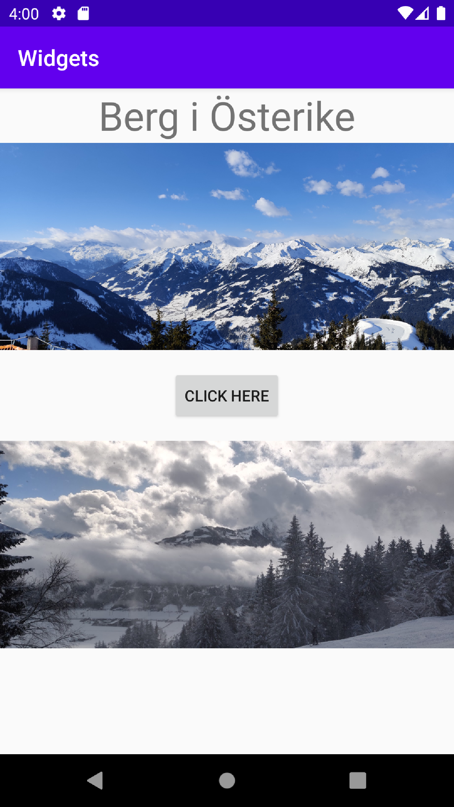

# Rapport

Skapade en TextView, Button och två stycken ImageView i en LinearLayout.
Ändringar som utseende, storlek och marginaler utfördes i `activity_main.xml`,
samt text värden placerades i filen `strings.xml`.

```
    <TextView
        android:id="@+id/mountain_name"
        android:text="@string/mountain_name"
        android:textSize="36sp"
        android:layout_gravity="center"
        android:layout_width="wrap_content"
        android:layout_height="wrap_content">
    </TextView>
```
Denna kod skapar det översta text fältet, sätter de layout krav som finns och fältets innehåll.
Ett Id delas även ut, detta skulle kunna användas i samband med programkod kopplad till knappen etc.

